# Google Cloud Platform with Terraform IaC

## Terraform Installation on Windows OS

1. gcloud CLI
2. Terraform CLI
3. VS Code Editor
4. Terrafform plugin fo VS Code

## Install gcloud CLI on Windows 11

To install and initialize the Google Cloud CLI.
After initialization, run a few core gcloud CLI commands to view information about your installation and verify it was successful.


- [Click here to download gcloud CLI version 568.0.0](https://dl.google.com/dl/cloudsdk/channels/rapid/GoogleCloudSDKInstaller.exe)

1. Double click on it and follow this simple steps
2. Click on Next > I agree > All users > Next > Install > Next > Finish

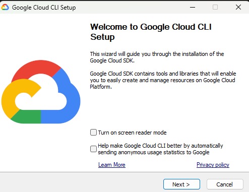

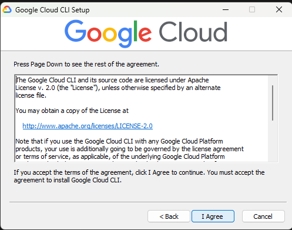

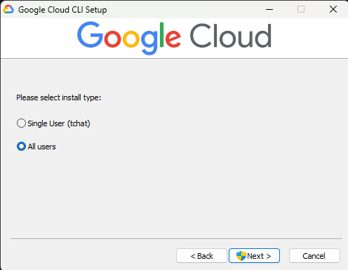

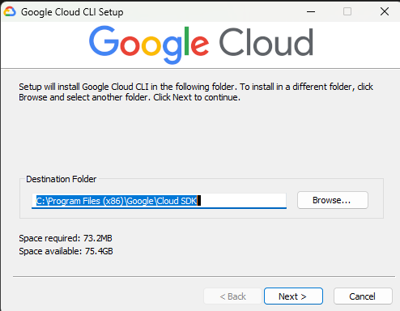

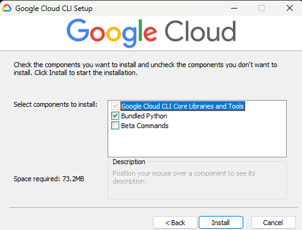

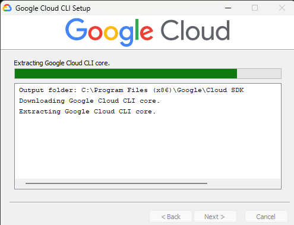
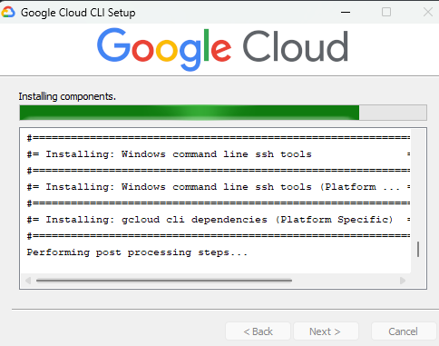

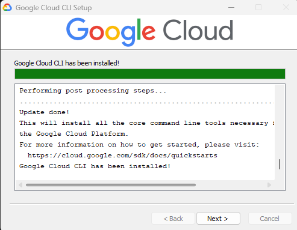

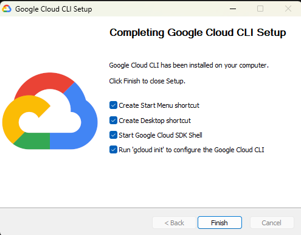

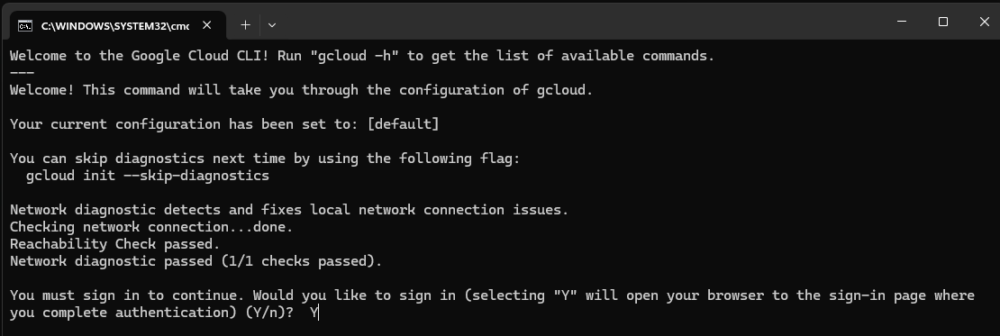

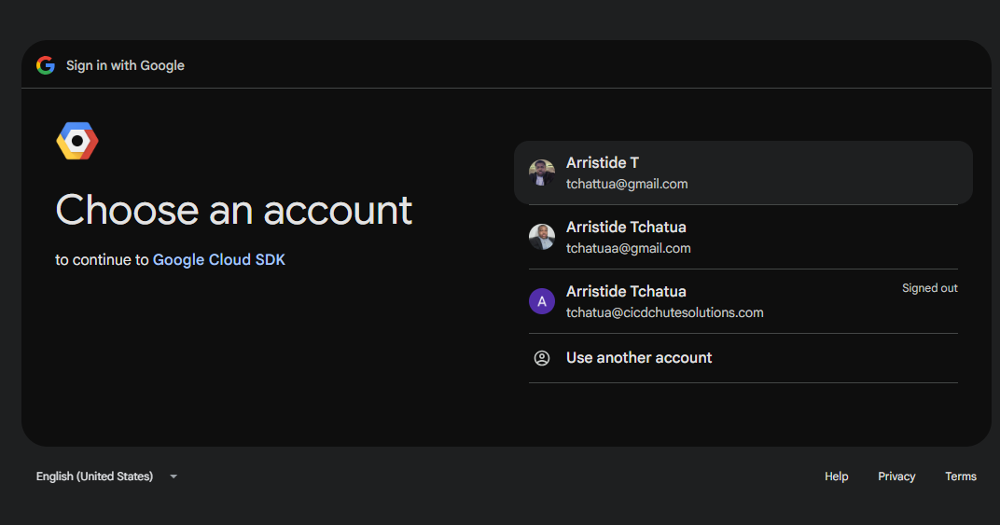

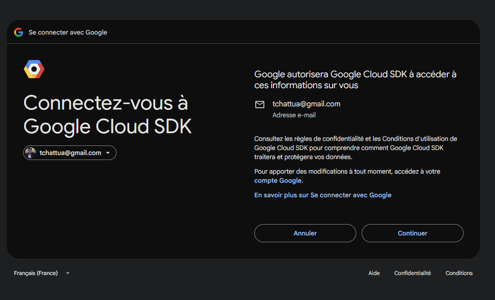

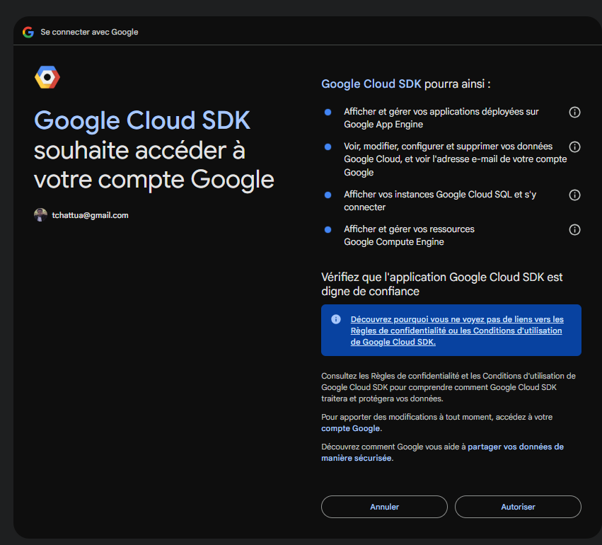

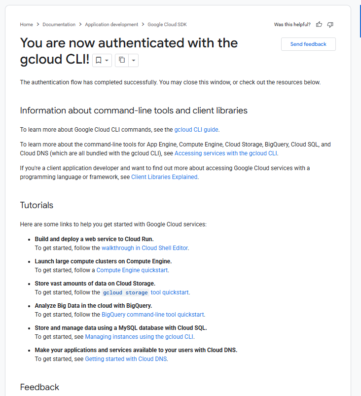

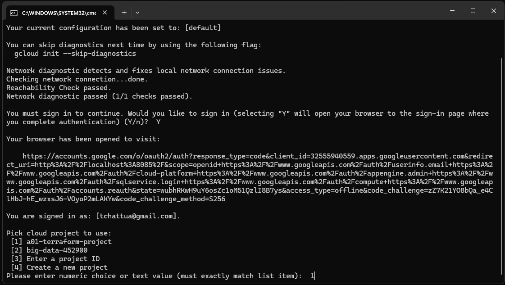

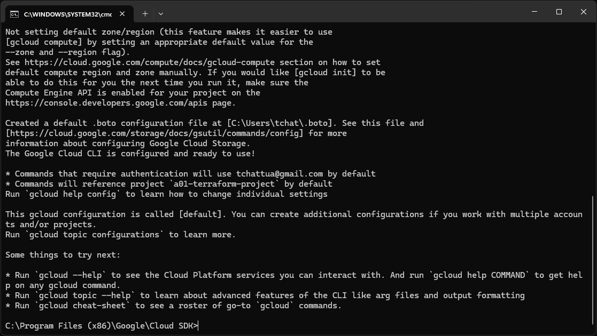

```t
Your browser has been opened to visit:

    https://accounts.google.com/o/oauth2/auth?response_type=code&client_id=32555940559.apps.googleusercontent.com&redirect_uri=http%3A%2F%2Flocalhost%3A8085%2F&scope=openid+https%3A%2F%2Fwww.googleapis.com%2Fauth%2Fuserinfo.email+https%3A%2F%2Fwww.googleapis.com%2Fauth%2Fcloud-platform+https%3A%2F%2Fwww.googleapis.com%2Fauth%2Fappengine.admin+https%3A%2F%2Fwww.googleapis.com%2Fauth%2Fsqlservice.login+https%3A%2F%2Fwww.googleapis.com%2Fauth%2Fcompute+https%3A%2F%2Fwww.googleapis.com%2Fauth%2Faccounts.reauth&state=wubhRKwH9uY6osZc1oM51QzlI8B7ys&access_type=offline&code_challenge=zZ7K21YO8bQa_e4ClHbJ-hE_wzxsJ6-VOyoP2mLAKYw&code_challenge_method=S256

You are signed in as: [tchattua@gmail.com].

Pick cloud project to use:
 [1] a01-terraform-project
 [2] big-data-452900
 [3] Enter a project ID
 [4] Create a new project
Please enter numeric choice or text value (must exactly match list item):  1

Your current project has been set to: [a01-terraform-project].

Not setting default zone/region (this feature makes it easier to use
[gcloud compute] by setting an appropriate default value for the
--zone and --region flag).
See https://cloud.google.com/compute/docs/gcloud-compute section on how to set
default compute region and zone manually. If you would like [gcloud init] to be
able to do this for you the next time you run it, make sure the
Compute Engine API is enabled for your project on the
https://console.developers.google.com/apis page.

Created a default .boto configuration file at [C:\Users\tchat\.boto]. See this file and
[https://cloud.google.com/storage/docs/gsutil/commands/config] for more
information about configuring Google Cloud Storage.
The Google Cloud CLI is configured and ready to use!

* Commands that require authentication will use tchattua@gmail.com by default
* Commands will reference project `a01-terraform-project` by default
Run `gcloud help config` to learn how to change individual settings

This gcloud configuration is called [default]. You can create additional configurations if you work with multiple accounts and/or projects.
Run `gcloud topic configurations` to learn more.

Some things to try next:

* Run `gcloud --help` to see the Cloud Platform services you can interact with. And run `gcloud help COMMAND` to get help on any gcloud command.
* Run `gcloud topic --help` to learn about advanced features of the CLI like arg files and output formatting
* Run `gcloud cheat-sheet` to see a roster of go-to `gcloud` commands.

C:\Program Files (x86)\Google\Cloud SDK>
```

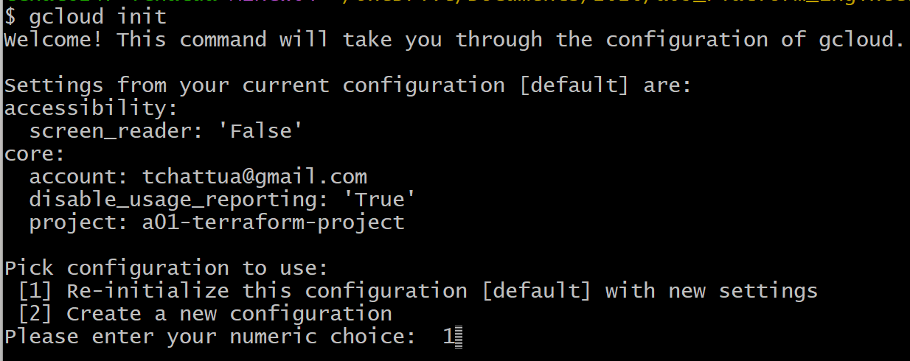

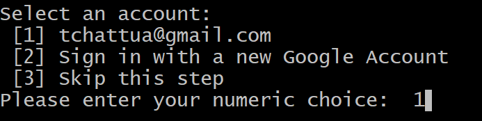

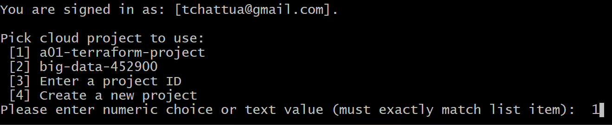

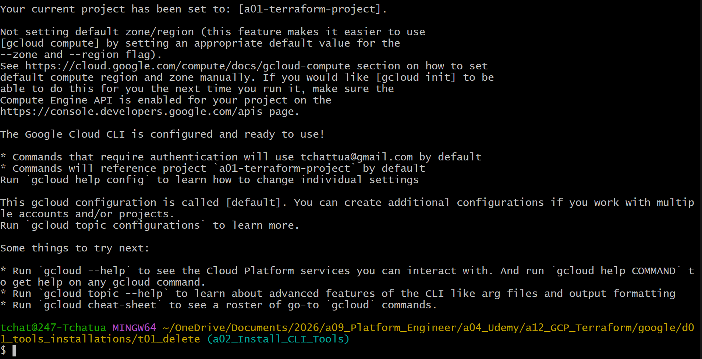

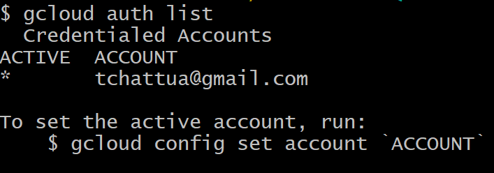

```t
$ gcloud auth list
  Credentialed Accounts
ACTIVE  ACCOUNT
*       tchattua@gmail.com

To set the active account, run:
    $ gcloud config set account `ACCOUNT`
```


```t
$ gcloud info
Google Cloud SDK [568.0.0]

Platform: [Windows, x86_64] uname_result(system='Windows', node='247-Tchatua', release='11', version='10.0.26200', machine='AMD64')
Locale: ('English_United States', '1252')
Python Version: [3.13.3 (tags/v3.13.3:6280bb5, Apr  8 2025, 14:47:33) [MSC v.1943 64 bit (AMD64)]]
Python Location: [c:\python313\python.exe]
OpenSSL: [OpenSSL 3.0.16 11 Feb 2025]
Requests Version: [2.32.3]
urllib3 Version: [2.6.3]
Default CA certs file: [C:\Program Files (x86)\Google\Cloud SDK\google-cloud-sdk\lib\third_party\certifi\cacert.pem]
Site Packages: [Disabled]

Installation Root: [C:\Program Files (x86)\Google\Cloud SDK\google-cloud-sdk]
Installed Components:
  bq: [2.1.31]
  core: [2026.05.08]
  gcloud-crc32c: [1.0.0]
  gsutil: [5.37]
System PATH: [C:\Users\tchat\bin;C:\Program Files\Git\mingw64\bin;C:\Program Files\Git\usr\local\bin;C:\Program Files\Git\usr\bin;C:\Program Files\Git\usr\bin;C:\Program Files\Git\mingw64\bin;C:\Program Files\Git\usr\bin;C:\Users\tchat\bin;C:\Program Files (x86)\TRICENTIS\Tosca Testsuite\ToscaCommander;C:\Program Files\Common Files\Oracle\Java\javapath;C:\Python313\Scripts;C:\Python313;C:\Program Files\Microsoft SDKs\Azure\CLI2\wbin;C:\Program Files\Microsoft MPI\Bin;C:\WINDOWS\system32;C:\WINDOWS;C:\WINDOWS\System32\Wbem;C:\WINDOWS\System32\WindowsPowerShell\v1.0;C:\WINDOWS\System32\OpenSSH;C:\Program Files (x86)\Microsoft SQL Server\160\Tools\Binn;C:\Program Files\Microsoft SQL Server\160\Tools\Binn;C:\Program Files\Microsoft SQL Server\Client SDK\ODBC\170\Tools\Binn;C:\Program Files\Microsoft SQL Server\160\DTS\Binn;C:\Program Files (x86)\Microsoft SQL Server\160\DTS\Binn;C:\Program Files\Microsoft SQL Server\150\Tools\Binn;C:\Program Files\Python313\tcl\tcl8.6;C:\Program Files\Python313;C:\Program Files\PuTTY;C:\WINDOWS\system32;C:\WINDOWS;C:\WINDOWS\System32\Wbem;C:\WINDOWS\System32\WindowsPowerShell\v1.0;C:\WINDOWS\System32\OpenSSH;C:\Program Files\PowerShell\7;C:\ProgramData\chocolatey\bin;C:\Program Files\Red Hat OpenShift Local;C:\Program Files\Vagrant\bin;C:\Program Files\Git\cmd;C:\Program Files\Docker\Docker\resources\bin;C:\Users\tchat\AppData\Local\nvm;C:\nvm4w\nodejs;C:\Program Files\Amazon\AWSCLIV2;C:\ProgramData\chocolatey\lib\maven\apache-maven-3.9.12\bin;C:\Program Files\apache-maven-3.9.12\bin;C:\Program Files\dotnet;C:\Program Files (x86)\Google\Cloud SDK\google-cloud-sdk\bin;C:\Users\tchat\anaconda3;C:\Users\tchat\anaconda3\Library\mingw-w64\bin;C:\Users\tchat\anaconda3\Library\usr\bin;C:\Users\tchat\anaconda3\Library\bin;C:\Users\tchat\anaconda3\Scripts;C:\Users\tchat\AppData\Local\Programs\Python\Python310\Scripts;C:\Users\tchat\AppData\Local\Programs\Python\Python310;C:\Users\tchat\AppData\Local\Microsoft\WindowsApps;C:\Users\tchat\AppData\Local\Programs\Microsoft VS Code\bin;C:\Users\tchat\.dotnet\tools;C:\Program Files\JetBrains\PyCharm Community Edition 2024.3\bin;C:\terraform;C:\Users\tchat\bin;C:\Program Files\argo-rollout;C:\Users\tchat\AppData\Roaming\npm;C:\Users\tchat\AppData\Local\nvm;C:\nvm4w\nodejs;C:\Program Files\Processing;C:\Program Files\Git\usr\bin\vendor_perl;C:\Program Files\Git\usr\bin\core_perl]
Python PATH: [C:\Program Files (x86)\Google\Cloud SDK\google-cloud-sdk\lib\third_party;C:\Program Files (x86)\Google\Cloud SDK\google-cloud-sdk\lib;c:\python313\python313.zip;c:\python313\DLLs;c:\python313\Lib;c:\python313]
Cloud SDK on PATH: [True]
Kubectl on PATH: [False]

Installation Properties: [C:\Program Files (x86)\Google\Cloud SDK\google-cloud-sdk\properties]
User Config Directory: [C:\Users\tchat\AppData\Roaming\gcloud]
Active Configuration Name: [default]
Active Configuration Path: [C:\Users\tchat\AppData\Roaming\gcloud\configurations\config_default]

Account: [tchattua@gmail.com]
Project: [a01-terraform-project]
Universe Domain: [googleapis.com]

Current Properties:
  [accessibility]
    screen_reader: [False] (property file)
  [core]
    account: [tchattua@gmail.com] (property file)
    disable_usage_reporting: [True] (property file)
    project: [a01-terraform-project] (property file)

Logs Directory: [C:\Users\tchat\AppData\Roaming\gcloud\logs]
Last Log File: [C:\Users\tchat\AppData\Roaming\gcloud\logs\2026.05.16\06.00.30.737587.log]

git: [git version 2.52.0.windows.1]
ssh: [OpenSSH_10.2p1, OpenSSL 3.5.4 30 Sep 2025]
```

```t
$ gcloud config configurations list
NAME     IS_ACTIVE  ACCOUNT             PROJECT                COMPUTE_DEFAULT_ZONE  COMPUTE_DEFAULT_REGION
default  True       tchattua@gmail.com  a01-terraform-project
```

### Configure GCP Credentials (ADC: Application Default Credentials)

- To allow Terraform CLI to communicate with GCP

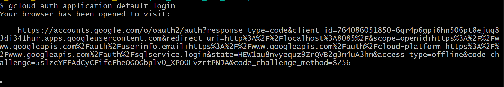

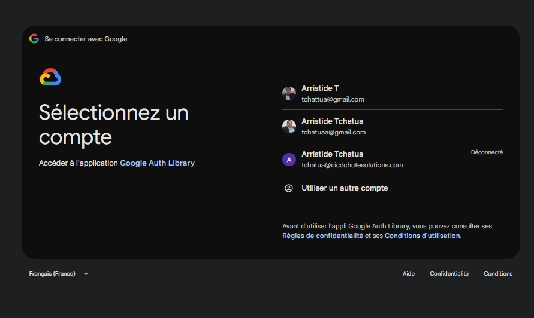

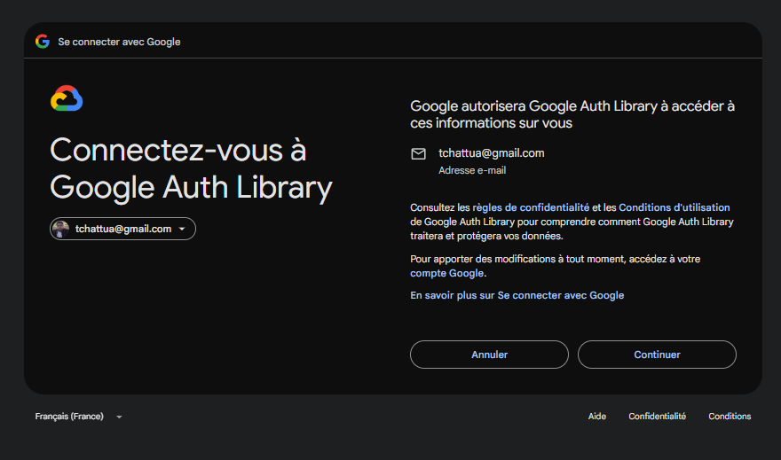

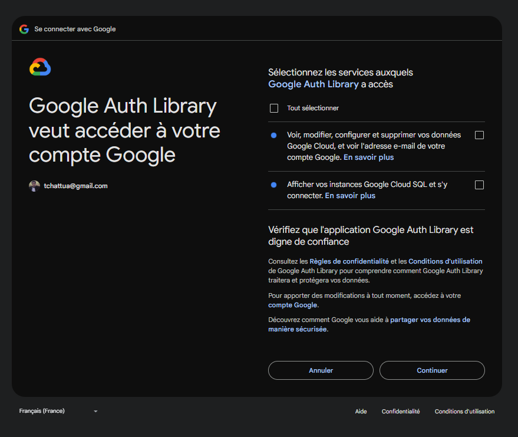

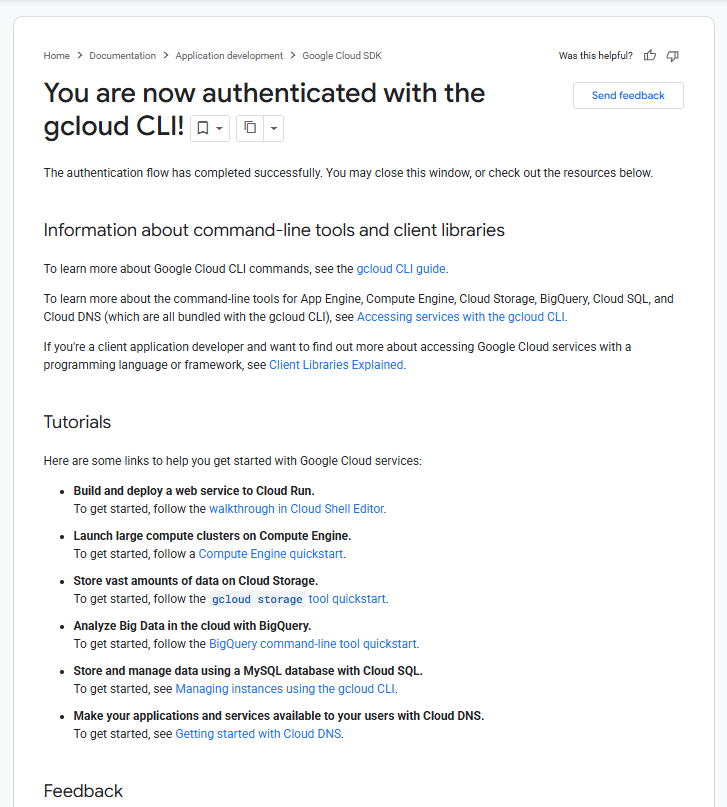

## Install Terraform CLI

Installing Terraform CLI for thos using choco:

```t
choco install terraform
```

Or [Click here to download Terraform Binary matching with your Windows OS](https://developer.hashicorp.com/terraform/install#windows)
- Unzip the package
- Create new folder terraform
- Copy the terraform.exe to a terraform
- Set PATH in windows

```t
$ terraform version
Terraform v1.14.3
on windows_386

Your version of Terraform is out of date! The latest version
is 1.15.3. You can update by downloading from https://developer.hashicorp.com/terraform/install
```

- I just download the new terraform.exe file and replace the existing one in my laptop
```t
$ terraform version
Terraform v1.15.3
on windows_386
```

## Install VS Code Editor

Click here to [Download Visual Studio Code for Windows 10, 11](https://code.visualstudio.com/download)
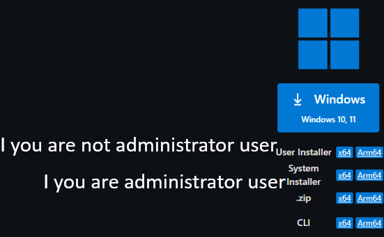

## Install Terrafform plugin fo VS Code

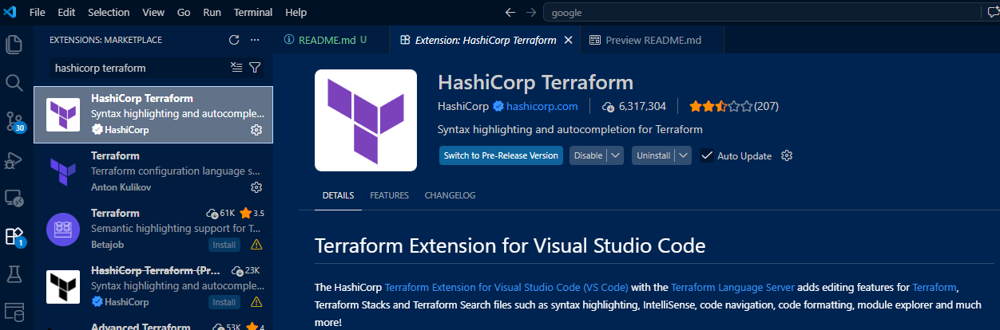


```t

```
```t

```
```t

```
```t

```
```t

```
```t

```
```t

```
```t

```
```t

```
```t

```
```t

```
```t

```
```t

```
```t

```
