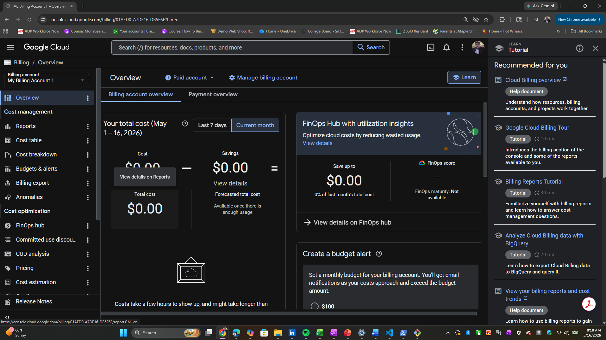
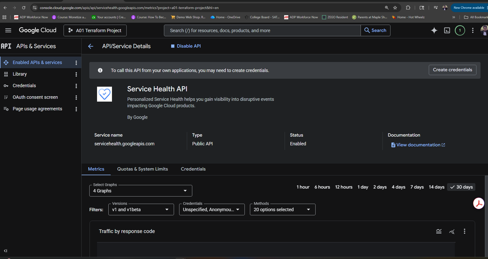
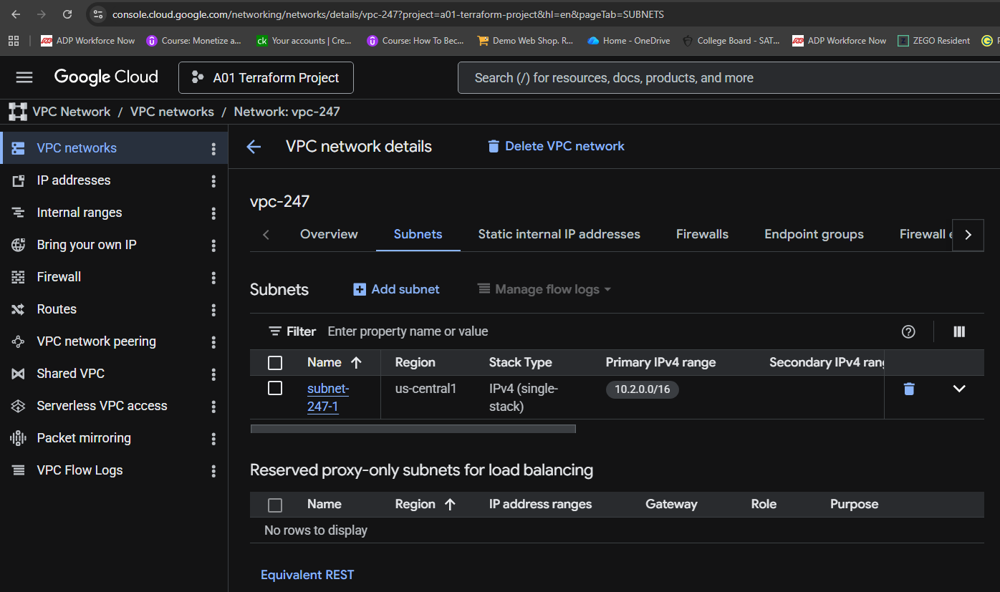

# Terraform Commands

```t
$ gcloud projects list
PROJECT_ID             NAME                   PROJECT_NUMBER  ENVIRONMENT
a01-terraform-project  A01 Terraform Project  307850114744
big-data-452900        Big Data               1018944123533
```

## Terraform CLI


```t
$ terraform init
Initializing provider plugins found in the configuration...
- Finding hashicorp/google versions matching "7.32.0"...
- Installing hashicorp/google v7.32.0...
- Installed hashicorp/google v7.32.0 (signed by HashiCorp)

Initializing the backend...


Terraform has created a lock file .terraform.lock.hcl to record the provider
selections it made above. Include this file in your version control repository
so that Terraform can guarantee to make the same selections by default when
you run "terraform init" in the future.

Terraform has been successfully initialized!

You may now begin working with Terraform. Try running "terraform plan" to see
any changes that are required for your infrastructure. All Terraform commands
should now work.

If you ever set or change modules or backend configuration for Terraform,
rerun this command to reinitialize your working directory. If you forget, other
commands will detect it and remind you to do so if necessary.
```

```t
$ terraform validate
Success! The configuration is valid.
```

```t
$ tree .terraform/
.terraform/
`-- providers
    `-- registry.terraform.io
        `-- hashicorp
            `-- google
                `-- 7.32.0
                    `-- windows_386
                        |-- LICENSE.txt
                        `-- terraform-provider-google_v7.32.0_x5.exe
```


```t
$ terraform plan

Planning failed. Terraform encountered an error while generating this plan.

╷
│ Error: Attempted to load application default credentials since neither `credentials` nor `access_token` was set in the provider block.  No credentials loaded. To use your gcloud credentials, run 'gcloud auth application-default login'.  Original error: google: could not find default credentials. See https://cloud.google.com/docs/authentication/external/set-up-adc for more information
│
│   with provider["registry.terraform.io/hashicorp/google"],
│   on a01_provider.tf line 11, in provider "google":
│   11: provider "google" {

```

```t
PS C:\WINDOWS\system32> Set-ExecutionPolicy RemoteSigned

Execution Policy Change
The execution policy helps protect you from scripts that you do not trust. Changing the execution policy might expose you to the security risks described in the
about_Execution_Policies help topic at https:/go.microsoft.com/fwlink/?LinkID=135170. Do you want to change the execution policy?
[Y] Yes  [A] Yes to All  [N] No  [L] No to All  [S] Suspend  [?] Help (default is "N"): Y
PS C:\WINDOWS\system32> gcloud auth application-default login
Your browser has been opened to visit:

    https://accounts.google.com/o/oauth2/auth?response_type=code&client_id=764086051850-6qr4p6gpi6hn506pt8ejuq83di341hur.apps.googleusercontent.com&redirect_uri=http%3A%2F%2Flocalhost%3A8085%2F&scope=openid+https%3A%2F%2Fwww.googleapis.com%2Fauth%2Fuserinfo.email+https%3A%2F%2Fwww.googleapis.com%2Fauth%2Fcloud-platform+https%3A%2F%2Fwww.googleapis.com%2Fauth%2Fsqlservice.login&state=30VIir1N5LO0YeTzm659tCm32yW1w3&access_type=offline&code_challenge=YmVTcyuyw2k3tC9Pnf4N9cmu-DqnhhH9Ss11N3tFyXE&code_challenge_method=S256


Credentials saved to file: [C:\Users\tchat\AppData\Roaming\gcloud\application_default_credentials.json]

These credentials will be used by any library that requests Application Default Credentials (ADC).

Quota project "a01-terraform-project" was added to ADC which can be used by Google client libraries for billing and quota. Note that some services may still bill the project owning the resource.
PS C:\WINDOWS\system32>
```

```t
$ terraform plan

Terraform used the selected providers to generate the following execution plan. Resource actions are indicated
with the following symbols:
  + create

Terraform will perform the following actions:

  # google_compute_network.vpc247 will be created
  + resource "google_compute_network" "vpc247" {
      + auto_create_subnetworks                   = false
      + bgp_always_compare_med                    = (known after apply)
      + bgp_best_path_selection_mode              = (known after apply)
      + bgp_inter_region_cost                     = (known after apply)
      + delete_bgp_always_compare_med             = false
      + delete_default_routes_on_create           = false
      + gateway_ipv4                              = (known after apply)
      + id                                        = (known after apply)
      + internal_ipv6_range                       = (known after apply)
      + mtu                                       = (known after apply)
      + name                                      = "vpc-247"
      + network_firewall_policy_enforcement_order = "AFTER_CLASSIC_FIREWALL"
      + network_id                                = (known after apply)
      + numeric_id                                = (known after apply)
      + project                                   = "A01 Terraform Project"
      + routing_mode                              = (known after apply)
      + self_link                                 = (known after apply)
    }

  # google_compute_subnetwork.subnet247 will be created
  + resource "google_compute_subnetwork" "subnet247" {
      + allow_subnet_cidr_routes_overlap = (known after apply)
      + creation_timestamp               = (known after apply)
      + external_ipv6_prefix             = (known after apply)
      + fingerprint                      = (known after apply)
      + gateway_address                  = (known after apply)
      + id                               = (known after apply)
      + internal_ipv6_prefix             = (known after apply)
      + ip_cidr_range                    = "10.2.0.0/16"
      + ipv6_cidr_range                  = (known after apply)
      + ipv6_gce_endpoint                = (known after apply)
      + name                             = "subnet-247-1"
      + network                          = (known after apply)
      + private_ip_google_access         = (known after apply)
      + private_ipv6_google_access       = (known after apply)
      + project                          = "A01 Terraform Project"
      + purpose                          = (known after apply)
      + region                           = "us-central1"
      + self_link                        = (known after apply)
      + stack_type                       = (known after apply)
      + state                            = (known after apply)
      + subnetwork_id                    = (known after apply)

      + secondary_ip_range (known after apply)
    }

Plan: 2 to add, 0 to change, 0 to destroy.

──────────────────────────────────────────────────────────────────────────────────────────────────────────────

Note: You didn't use the -out option to save this plan, so Terraform can't guarantee to take exactly these
actions if you run "terraform apply" now.
```

```t
$ gcloud auth list
  Credentialed Accounts
ACTIVE  ACCOUNT
*       tchattua@gmail.com

To set the active account, run:
    $ gcloud config set account `ACCOUNT`
# -----------------------------------------------------------
$ gcloud config set account tchattua@gmail.com
Updated property [core/account].
# -----------------------------------------------------------
$ gcloud config get-value project
a01-terraform-project
```





```t
$ terraform apply --auto-approve

Terraform used the selected providers to generate the following execution plan. Resource actions are indicated
with the following symbols:
  + create

Terraform will perform the following actions:

  # google_compute_network.vpc247 will be created
  + resource "google_compute_network" "vpc247" {
      + auto_create_subnetworks                   = false
      + bgp_always_compare_med                    = (known after apply)
      + bgp_best_path_selection_mode              = (known after apply)
      + bgp_inter_region_cost                     = (known after apply)
      + delete_bgp_always_compare_med             = false
      + delete_default_routes_on_create           = false
      + gateway_ipv4                              = (known after apply)
      + id                                        = (known after apply)
      + internal_ipv6_range                       = (known after apply)
      + mtu                                       = (known after apply)
      + name                                      = "vpc-247"
      + network_firewall_policy_enforcement_order = "AFTER_CLASSIC_FIREWALL"
      + network_id                                = (known after apply)
      + numeric_id                                = (known after apply)
      + project                                   = "a01-terraform-project"
      + routing_mode                              = (known after apply)
      + self_link                                 = (known after apply)
    }

  # google_compute_subnetwork.subnet247 will be created
  + resource "google_compute_subnetwork" "subnet247" {
      + allow_subnet_cidr_routes_overlap = (known after apply)
      + creation_timestamp               = (known after apply)
      + external_ipv6_prefix             = (known after apply)
      + fingerprint                      = (known after apply)
      + gateway_address                  = (known after apply)
      + id                               = (known after apply)
      + internal_ipv6_prefix             = (known after apply)
      + ip_cidr_range                    = "10.2.0.0/16"
      + ipv6_cidr_range                  = (known after apply)
      + ipv6_gce_endpoint                = (known after apply)
      + name                             = "subnet-247-1"
      + network                          = (known after apply)
      + private_ip_google_access         = (known after apply)
      + private_ipv6_google_access       = (known after apply)
      + project                          = "a01-terraform-project"
      + purpose                          = (known after apply)
      + region                           = "us-central1"
      + self_link                        = (known after apply)
      + stack_type                       = (known after apply)
      + state                            = (known after apply)
      + subnetwork_id                    = (known after apply)

      + secondary_ip_range (known after apply)
    }

Plan: 2 to add, 0 to change, 0 to destroy.
google_compute_network.vpc247: Creating...
google_compute_network.vpc247: Still creating... [00m10s elapsed]
google_compute_network.vpc247: Still creating... [00m20s elapsed]
google_compute_network.vpc247: Still creating... [00m30s elapsed]
google_compute_network.vpc247: Creation complete after 32s [id=projects/a01-terraform-project/global/networks/vpc-247]
google_compute_subnetwork.subnet247: Creating...
google_compute_subnetwork.subnet247: Still creating... [00m10s elapsed]
google_compute_subnetwork.subnet247: Creation complete after 13s [id=projects/a01-terraform-project/regions/us-central1/subnetworks/subnet-247-1]

Apply complete! Resources: 2 added, 0 changed, 0 destroyed.
```

## Verify the resources created



