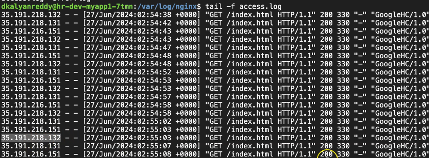

# Terraform datasources


```t
$ dos2unix script.sh
dos2unix: converting file script.sh to Unix format...

sudo ss -tulpn | grep nginxp nginx
tcp   LISTEN 0      511          0.0.0.0:80        0.0.0.0:*    users:(("nginx",pid=1536,fd=5),("nginx",pid=1535,fd=5),("nginx",pid=1532,fd=5))
tcp   LISTEN 0      511             [::]:80           [::]:*    users:(("nginx",pid=1536,fd=6),("nginx",pid=1535,fd=6),("nginx",pid=1532,fd=6))
```




